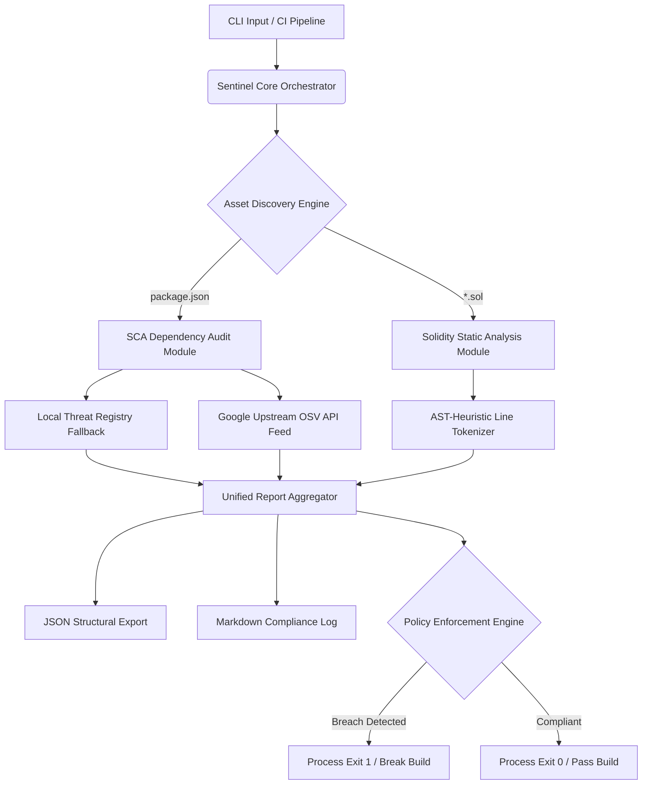

# Web3-Guard Sentinel

Web3-Guard Sentinel is an enterprise-grade static application security testing (SAST) utility and software composition analysis (SCA) engine designed for blockchain ecosystems. It evaluates project manifest dependencies against live vulnerability feeds and performs pattern-based static analysis on Solidity smart contracts to enforce automated security compliance within DevSecOps pipelines.

---

## System Architecture & Data Flow

The engine operates on a decoupled, modular design to maximize execution speed and maintain strict separation of concerns.

## Module Breakdown

1. Orchestrator Context (sentinel.ts): Initializes core services, leverages native cross-platform token parsing to sanitize inputs, and configures enforcement thresholds.

2. SCA Engine (scanner.ts): Extracts the localized dependency tree and runs concurrent asynchronous lookups using a pool pattern.

3. Upstream Broker (osvService.ts): A network connection client interfacing with Google's Open Source Vulnerability (OSV) API database.

4. Solidity Parser (contractScanner.ts): Reads smart contract code sequentially to intercept known offensive vulnerability anti-patterns.

5. Automation Compliance Reporter (fileReporter.ts): Collects findings and handles asynchronous file system outputs.

## Core Features

* Real-Time Threat Intelligence: Queries live distributed CVE and GitHub Advisory (GHA) record networks concurrently.

* Smart Contract Static Analysis: Tokenizes raw .sol files to flags structural exploits, security bugs, and design anti-patterns.

* Pipeline Enforcement (Policy-as-Code): Supports strict severity thresholds (--fail-on HIGH) to break automated CI/CD builds when severe risks are introduced.

* Zero-Dependency Runtime Mapping: Runs natively using pure modern ECMAScript Modules (ESM) and Node.js core APIs for security and efficiency.