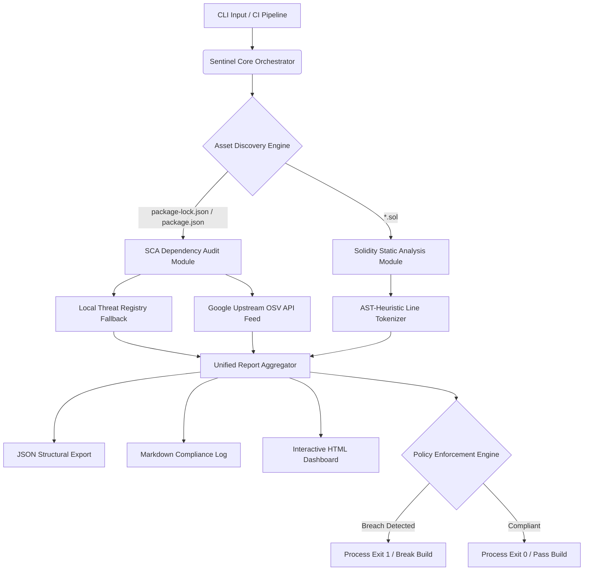
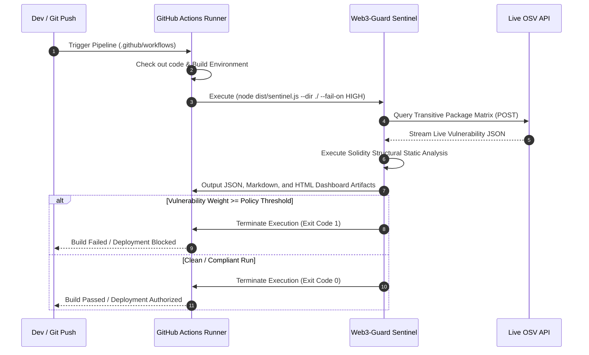

# Web3-Guard Sentinel

Web3-Guard Sentinel is an enterprise-grade static application security testing (SAST) utility and software composition analysis (SCA) engine designed for blockchain ecosystems. It evaluates project lockfile dependencies against live vulnerability feeds and performs pattern-based static analysis on Solidity smart contracts to enforce automated security compliance within DevSecOps pipelines.

---

## System Architecture & Data Flow

The engine operates on a decoupled, modular design to maximize execution speed and maintain strict separation of concerns.



## Module Breakdown

1. **Orchestrator Context** (`sentinel.ts`): Initializes core services, leverages native cross-platform argument parsing (util.parseArgs) to handle parameters, and configures enforcement thresholds.
2. **SCA Engine** (`scanner.ts`): Detects and unpacks full package dependency graphs, resolving both top-level manifest libraries and nested transitive sub-dependencies before running asynchronous lookups.
3. **Upstream Broker** (`osvService.ts`): Interfaces with Google's Open Source Vulnerability (OSV) API database to query real-time security disclosures.
4. **Solidity Parser** (`contractScanner.ts`): Reads smart contract source code sequentially to identify known vulnerability anti-patterns.
5. **Automation Compliance Reporter** (`fileReporter.ts`): Collects findings to orchestrate clean Markdown, JSON, and theme-isolated single-page HTML dashboard generation.

## Core Features

- **Transitive Dependency Graph Analysis**: Unpacks full lockfile trees (package-lock.json formats v1, v2, and v3) to detect deep, nested, and hidden downstream security risks.
- **Real-Time Threat Intelligence**: Queries live distributed CVE and GitHub Advisory (GHA) feeds concurrently via a high-performance promise pool design.
- **Smart Contract Static Analysis**: Tokenizes raw .sol files to flag structural exploits, security bugs, and design anti-patterns.
- **Pipeline Enforcement (Policy-as-Code)**: Supports strict severity thresholds (--fail-on HIGH) to break automated CI/CD builds when severe risks are introduced.
- **Zero-Dependency Runtime Mapping**: Runs natively using pure modern ECMAScript Modules (ESM) and Node.js core APIs for optimal security and efficiency.

## Solidity Detection Vectors

The smart contract scanner implements line-by-line pattern matching to safeguard against systemic Web3 attack vectors.

| Vulnerability Vector | Severity | Audit Flag Condition | Risk Context |
| --- | --- | --- | --- |
| Reentrancy Insecurity | CRITICAL | Low-level `call{value: ...}` executed prior to localized state balance mutation. | Violates Checks-Effects-Interactions pattern; permits state re-entry to drain smart contract balances. |
| Insecure Access Control | HIGH | Utilization of `tx.origin` inside evaluation assertions or conditional guards. | Exposes administrative functionality to phishing and origin-spoofing proxy intervention exploits. |
| Outdated Compiler Specification | MEDIUM | Use of deprecated compiler versions (e.g. `^0.4.x`, `^0.5.x`, `^0.6.x`). | Leaves bytecode vulnerable to known, historic, unpatched compiler-level processing bugs. |

## Getting Started

### Prerequisites

- Node.js v20.0.0 or higher
- TypeScript v5.0.0 or higher

### Installation

Clone the repository and install the developer dependencies:

```bash
git clone https://github.com/Kefmat/web3-guard-sentinel.git
cd web3-guard-sentinel
npm ci
```

### Run

Compile and run the tool locally:

```bash
npm run build && npm start
```

### Example: enforce HIGH severity

```bash
node dist/sentinel.js --fail-on HIGH
```

## Continuous Integration (DevSecOps)

The tool is optimized to run inside a CI environment. It generates artifact compliance outputs automatically on every `push` or `pull_request`.


